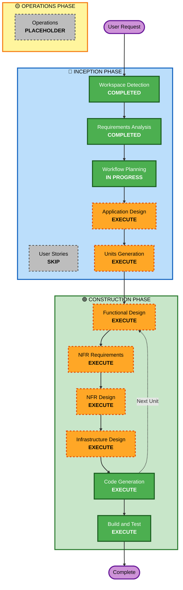

# Execution Plan - 테이블오더 서비스

## Project Overview

### User Request
테이블오더 서비스 구축 - 디지털 주문 시스템 (고객용 주문 인터페이스 + 관리자용 관리 시스템)

### Project Type
**Greenfield** - 새 프로젝트

### Complexity Assessment
**Complex** - 다중 사용자 인터페이스, 실시간 통신, 세션 관리, 인증/인가

---

## Detailed Analysis Summary

### Change Impact Assessment

#### User-facing changes
**Yes** - 고객용 및 관리자용 완전히 새로운 UI/UX
- 고객용: 메뉴 조회, 장바구니, 주문 생성, 주문 내역, 주문 취소
- 관리자용: 실시간 주문 모니터링, 테이블 관리, 메뉴 조회

#### Structural changes
**Yes** - 전체 시스템 아키텍처 설계 필요
- Frontend (React) + Backend (Spring Boot) + Database (PostgreSQL)
- 실시간 통신 (SSE)
- 인증/인가 시스템 (JWT)

#### Data model changes
**Yes** - 완전히 새로운 데이터 모델 설계 필요
- Store, Table, Menu, Category, Order, OrderItem, TableSession, Admin

#### API changes
**Yes** - 모든 API 엔드포인트 신규 설계
- 고객용 API: 메뉴 조회, 주문 생성, 주문 내역, 주문 취소
- 관리자용 API: 인증, 주문 모니터링, 테이블 관리, 메뉴 조회
- 실시간 API: SSE 엔드포인트

#### NFR impact
**Yes** - 성능, 보안, 확장성 고려 필요
- 성능: 3초 이내 응답, 10개 테이블 동시 접속
- 보안: JWT 인증, bcrypt 해싱
- 확장성: Docker 컨테이너, PostgreSQL, AWS S3

### Risk Assessment
- **Risk Level**: Medium
- **Rationale**: 새 프로젝트이지만 명확한 요구사항, 검증된 기술 스택 (Spring Boot, React, PostgreSQL)
- **Rollback Complexity**: Easy (새 프로젝트이므로 롤백 불필요)
- **Testing Complexity**: Moderate (TDD, Unit 테스트)

---

## Workflow Visualization

---

## Phases to Execute

### 🔵 INCEPTION PHASE

#### ✅ Completed Stages
- [x] **Workspace Detection** (COMPLETED)
  - Project Type: Greenfield
  - No existing code

- [x] **Requirements Analysis** (COMPLETED)
  - 요구사항 문서 생성 완료
  - 22개 검증 질문 답변 완료
  - 기술 스택 확정: Spring Boot + React + PostgreSQL + MyBatis

- [x] **Workflow Planning** (IN PROGRESS)
  - 실행 계획 수립 중

#### ⏭️ Skipped Stages
- [ ] **User Stories** - SKIP
  - **Rationale**: 명확한 요구사항 문서가 이미 존재하며, 단일 매장 운영자 및 고객이라는 명확한 사용자 그룹. User Stories 없이도 충분히 구현 가능.

#### 🔜 Stages to Execute
- [ ] **Application Design** - EXECUTE
  - **Rationale**: 전체 시스템 아키텍처 설계 필요. Frontend/Backend 컴포넌트 구조, 서비스 레이어, API 설계 필요.
  - **Artifacts**: 
    - Component identification (Frontend/Backend 컴포넌트)
    - Component methods (각 컴포넌트의 주요 메서드)
    - Service layer design (비즈니스 로직 서비스)

- [ ] **Units Generation** - EXECUTE
  - **Rationale**: 복잡한 시스템이므로 작업 단위로 분해 필요. Frontend/Backend 각각의 기능별 유닛 생성.
  - **Artifacts**:
    - Unit of work 정의
    - Unit 간 의존성 매핑
    - Unit-Story 매핑 (User Stories 없으므로 Requirements 기반)

---

### 🟢 CONSTRUCTION PHASE

#### 🔜 Per-Unit Design Stages (각 Unit마다 실행)
- [ ] **Functional Design** - EXECUTE
  - **Rationale**: 각 Unit의 상세 비즈니스 로직 설계 필요
  - **Artifacts**: 
    - 비즈니스 로직 플로우
    - 데이터 흐름
    - 에러 처리

- [ ] **NFR Requirements** - EXECUTE
  - **Rationale**: 성능, 보안, 확장성 요구사항을 각 Unit에 반영 필요
  - **Artifacts**:
    - 기술 스택 선택 (Unit별)
    - NFR 요구사항 매핑

- [ ] **NFR Design** - EXECUTE
  - **Rationale**: NFR 패턴 및 논리적 컴포넌트 설계 필요
  - **Artifacts**:
    - 아키텍처 패턴 (MVC, Layered Architecture)
    - 보안 패턴 (JWT, bcrypt)
    - 성능 패턴 (Caching, Connection Pooling)

- [ ] **Infrastructure Design** - EXECUTE
  - **Rationale**: Docker Compose, PostgreSQL, AWS S3 등 인프라 설계 필요
  - **Artifacts**:
    - Docker Compose 구성
    - Database 스키마
    - AWS S3 설정

#### 🔜 Always Execute Stages
- [ ] **Code Generation** - EXECUTE (ALWAYS)
  - **Rationale**: 실제 코드 구현 필요
  - **Approach**: TDD (Test-Driven Development)
  - **Artifacts**:
    - Part 1: Code Planning (구현 계획)
    - Part 2: Code Generation (실제 코드)

- [ ] **Build and Test** - EXECUTE (ALWAYS)
  - **Rationale**: 빌드 및 테스트 검증 필요
  - **Artifacts**:
    - Build scripts
    - Test execution results
    - Integration verification

---

### 🟡 OPERATIONS PHASE

- [ ] **Operations** - PLACEHOLDER
  - **Rationale**: 향후 배포 및 모니터링 워크플로우 확장 예정

---

## Execution Sequence

### Phase 1: INCEPTION (계획 및 설계)
1. ✅ Workspace Detection
2. ✅ Requirements Analysis
3. ✅ Workflow Planning
4. 🔜 Application Design
5. 🔜 Units Generation

### Phase 2: CONSTRUCTION (구현 및 테스트)
각 Unit마다 반복:
1. 🔜 Functional Design (Unit별)
2. 🔜 NFR Requirements (Unit별)
3. 🔜 NFR Design (Unit별)
4. 🔜 Infrastructure Design (Unit별)
5. 🔜 Code Generation (Unit별)

모든 Unit 완료 후:
6. 🔜 Build and Test (전체)

### Phase 3: OPERATIONS (배포 및 운영)
- Placeholder (향후 확장)

---

## Estimated Timeline

### INCEPTION Phase
- Application Design: 1 session
- Units Generation: 1 session
- **Subtotal**: 2 sessions

### CONSTRUCTION Phase
- Per-Unit Design (4 stages × N units): N sessions
- Code Generation (per unit): N sessions
- Build and Test: 1 session
- **Subtotal**: 2N + 1 sessions

**예상 Unit 수**: 6-8개 (Frontend 3-4개, Backend 3-4개)
**예상 총 소요 시간**: 15-20 sessions

---

## Success Criteria

### Primary Goal
테이블오더 서비스 MVP 구축 - 고객용 주문 시스템 + 관리자용 관리 시스템

### Key Deliverables
1. **Frontend (React)**:
   - 고객용 UI (메뉴 조회, 장바구니, 주문 생성, 주문 내역, 주문 취소)
   - 관리자용 UI (로그인, 실시간 주문 모니터링, 테이블 관리, 메뉴 조회)

2. **Backend (Spring Boot)**:
   - REST API (고객용, 관리자용)
   - SSE 엔드포인트 (실시간 주문 업데이트)
   - JWT 인증
   - MyBatis 기반 데이터 액세스

3. **Database (PostgreSQL)**:
   - 데이터 모델 (Store, Table, Menu, Category, Order, OrderItem, TableSession, Admin)
   - 스키마 및 인덱스

4. **Infrastructure**:
   - Docker Compose 구성
   - AWS S3 설정 (이미지 스토리지)

5. **Testing**:
   - Unit 테스트 (TDD)
   - Build 및 실행 검증

### Quality Gates
- ✅ 모든 요구사항 충족
- ✅ TDD 기반 Unit 테스트 작성
- ✅ 3초 이내 응답 시간
- ✅ 10개 테이블 동시 접속 지원
- ✅ Docker Compose로 로컬 실행 가능
- ✅ 반응형 디자인 (모든 디바이스)
- ✅ 한국어 + 영어 지원

---

## Next Steps

1. **Approve this execution plan**
2. **Proceed to Application Design** - 전체 시스템 아키텍처 및 컴포넌트 설계
3. **Continue through INCEPTION phase** - Units Generation
4. **Enter CONSTRUCTION phase** - Per-unit design and code generation

---

## Document Version
- **Version**: 1.0
- **Date**: 2026-02-09
- **Status**: Ready for approval
